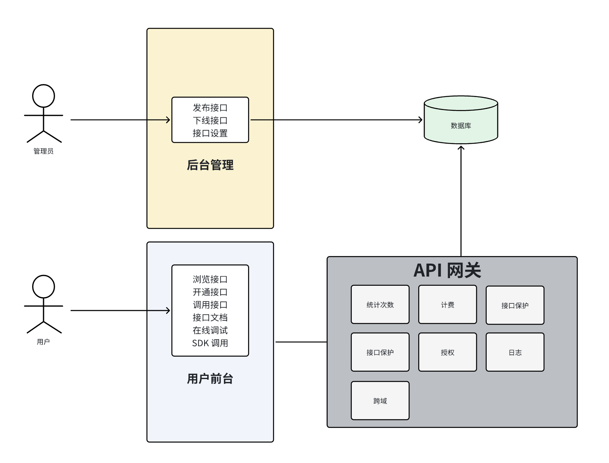

# NXApi (Next API)

您的下一款 API 开放平台

## 项目简介

NXApi 是一个为用户提供 API 调用的平台，旨在简化 API 集成过程并提供完整的管理功能。平台允许用户注册、登录并订阅接口。每次 API 调用都会被追踪并进行统计分析，同时，管理员可以发布、下线或接入新的接口，且可以可视化地查看接口的调用情况和数据。

## 核心功能

- **防止攻击**：确保 API 的安全性，防止恶意攻击。
- **调用限制**：通过用户授权来限制接口调用权限，确保接口资源得到有效管理。
- **调用统计**：实时统计每个用户的 API 调用次数，帮助管理和分析 API 使用情况。
- **计费系统**：根据调用次数进行计费，支持灵活的计费方式。
- **流量保护**：保障接口不被过度调用，确保平台稳定性。
- **API 接入管理**：支持第三方接口接入，方便开发者集成。

## 业务流程

## 技术选型

### 前端

- **React**：构建用户界面。
- **Ant Design Pro**：企业级应用框架，提供丰富的 UI 组件和功能。
- **Ant Design Pro Components**：用于构建各类功能模块。
- **Umi**：前端路由框架，提升开发效率。

### 后端

- **Spring Boot**：构建后端服务，提供高效的 API 支持。
- **Spring Boot Starter**：用于 SDK 开发，简化集成流程。
- **网关、限流和日志**：实现 API 网关功能、流量控制和日志记录。

## 项目计划

### Part 1: 项目初始化

- 完成项目设计和技术选型
- 搭建基础架构
- 实现 API 管理功能
- 用户注册和接口查看功能

### Part 2: 接口调用与开发

- 实现 API 调用和接口文档功能
- 开发 SDK，确保 API 调用的安全性
- 客户端 SDK 开发，方便开发者接入

### Part 3: 使用统计与管理

- 实现用户调用次数统计功能
- 添加流量限制功能
- 开发计费系统
- 实现接口授权和日志记录

### Part 4: 数据可视化

- 提供可视化图表展示 API 调用情况

---